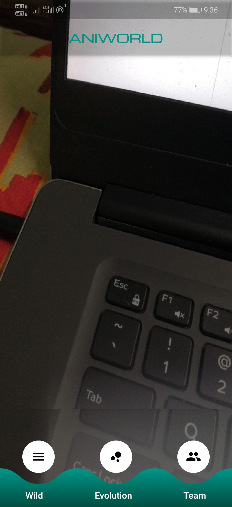
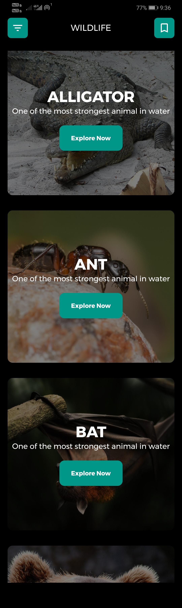

# AR-PROJECT-ANIWORLD
### This projcet is based on AR(Augumented Reality) and Deep learning.In this project we will see the intersection of different technologies together AR-CNN-Flutter.
### In this we built aan flutter native app that uses CNN to detect animals and google AR core api which gives us the 3D model of the animals this project also contains some general information about thoes animals.
### The major aim to create this project is to spread awarness and support wildlife protection and preservation.This app includes different animal species from endagered to common ones.
### Having AR-3D models give this project more intersting user experince.
### The project files are really big due to images and consecutive library.so it is uploaded on google drive use below link to download the project files.

## REQUIREMENT TO RUN THE PROJECT:-
### 1. Flutter new versions link:- https://storage.googleapis.com/flutter_infra/releases/stable/windows/flutter_windows_v1.12.13+hotfix.9-stable.zip for flutter installation please follow flutter website.
### 2. VS code:- https://code.visualstudio.com/download
### 3. Connected device:- Please connect any android smartphone and enable 'USB DEBUGING' in developer mode.This app is only for android smartphones

## HOW TO RUN THE PROJECT:-
### 1. Open the project folder in vscode.
### 2. use command 'flutter doctor' to check setup is correct for project.
### 3. use command 'flutter run' to run the flutter project in your smartphone.

## SOME SNAPSHOTS OF APP:-
   

